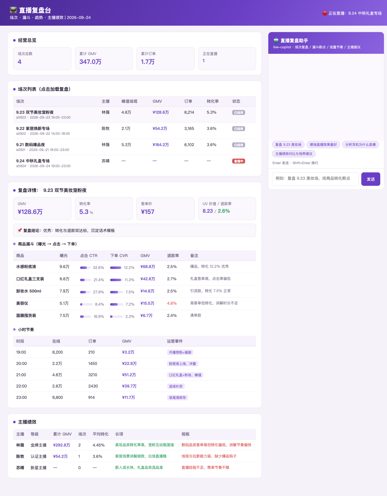
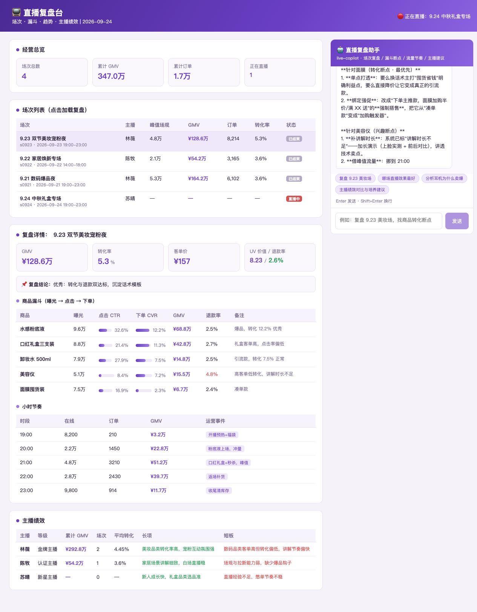
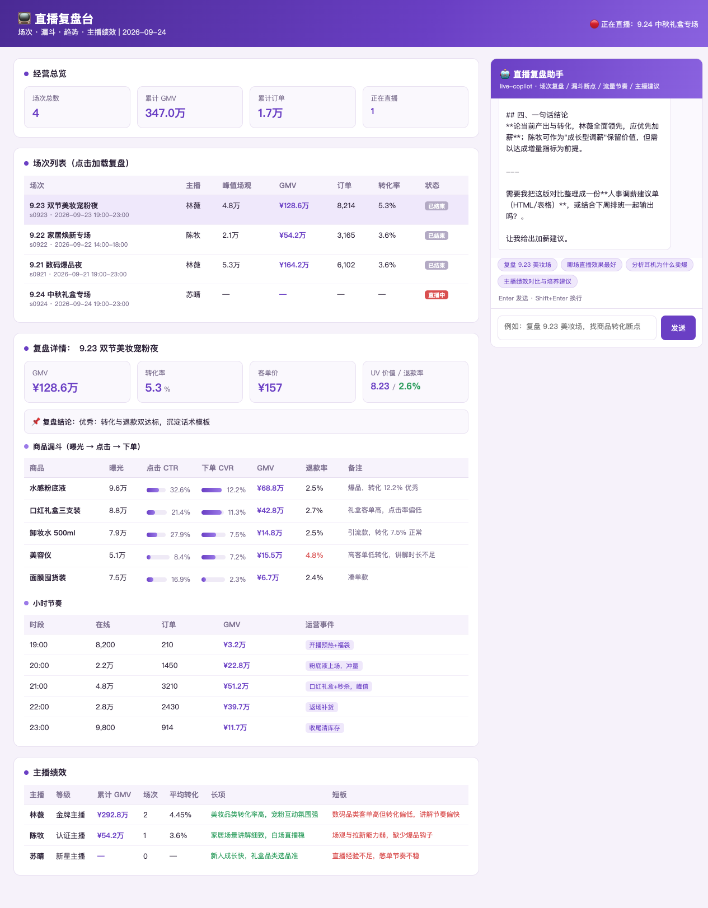
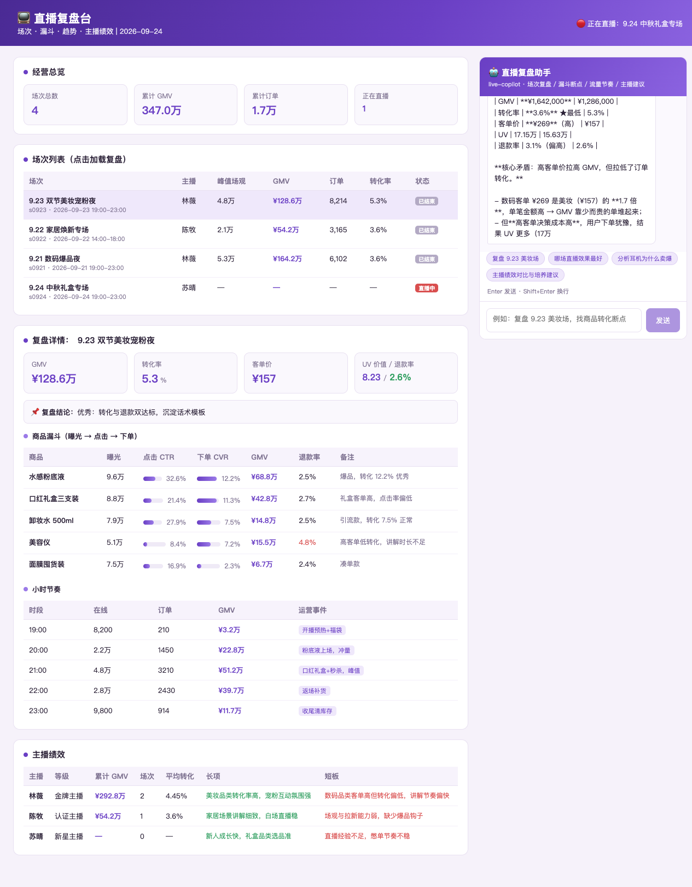

# livestream-review · 直播复盘台（DSH Java Native 插件场景案例 P52）

> 基于 **deepseek-harness-java（DSH）Java Native 插件机制** 的电商直播运营场景案例：场次管理 + 单场复盘指标（GMV/转化/客单/UV 价值/退款率）+ 商品成交漏斗（曝光→点击→下单）+ 小时流量趋势 + 主播绩效，通过 `live-copilot` 插件接入 AI 助手，支持自然语言复盘找断点、归因峰值、给主播排班建议。



## 一、项目组成

| 模块 | 说明 |
|------|------|
| `live-app` | Spring Boot 3.2 应用（端口 **18091**），直播复盘 REST API 与前端页面 |
| `live-plugin` | DSH Java Native 插件（`live-copilot`），打包 5 个 AI 工具 |

业务数据：3 场已结束直播（美妆/家居/数码，GMV 54万~164万）+ 1 场直播中，每场 4~5 个商品的完整漏斗与 5 个小时节点的运营事件，3 位主播（金牌/认证/新星）含长短板画像。

## 二、插件工具（5 个）

| 工具 | 说明 |
|------|------|
| `session_list` | 场次列表：标题/主播/峰值场观/GMV/转化率/状态 |
| `session_review` | 单场复盘：客单价、UV 价值、退款率 + 自动结论 |
| `goods_funnel` | 商品漏斗：曝光→点击→下单，CTR/CVR/退款率逐商品 |
| `hour_trend` | 小时趋势：在线/订单/GMV/运营事件（秒杀、福袋、返场） |
| `anchor_perf` | 主播绩效：累计 GMV/平均转化/长项短板 |

## 三、REST API

| 方法 | 路径 | 说明 |
|------|------|------|
| GET | `/api/sessions?status=` | 场次列表 |
| GET | `/api/session?id=` | 场次详情 |
| GET | `/api/review?id=` | 复盘指标 |
| GET | `/api/funnel?id=` | 商品漏斗 |
| GET | `/api/timeline?id=` | 小时趋势 |
| GET | `/api/anchors` | 主播绩效 |
| GET | `/api/overview` | 概览 |
| POST | `/api/assistant/stream` | AI 助手 SSE（透传 DSH） |

## 四、快速开始

```bash
mvn clean package -DskipTests
java -Dserver.port=18091 -jar live-app/target/live-app-1.0.0-SNAPSHOT.jar

bash install_plugin.sh live-plugin/target/live-plugin-1.0.0-SNAPSHOT.jar \
  live-copilot 1.0.0-SNAPSHOT live-plugin-1.0.0-SNAPSHOT.jar "直播复盘助手"

open http://127.0.0.1:18091/
```

## 五、端到端验证

```bash
bash agent_stream.sh 127.0.0.1:8090 live-copilot "复盘 9.23 美妆场，商品漏斗有没有断点？"
bash agent_stream.sh 127.0.0.1:8090 live-copilot "对比林薇和陈牧的绩效，给排班建议"
bash agent_stream.sh 127.0.0.1:8090 live-copilot "9.21 数码场 GMV 最高但转化率最低，为什么？"
```

验证截图：

| 截图 | 内容 |
|------|------|
|  | AI 定位美容仪/面膜转化断点并给改进动作 |
|  | AI 一句话结论「林薇全面领先，优先加薪」+ 排班方案 |
|  | AI 拆解数码场高 GMV 低转化原因 |

## 六、技术要点

- **复盘指标模型**：客单价 = GMV/订单，UV 价值 = GMV/UV，退款率 = 退款/订单；按「转化 ≥5% 且退款 <3%」双阈值自动给结论。
- **漏斗断点**：每个商品标注 CTR（曝光→点击）与 CVR（点击→下单）两级转化，AI 能区分「货不对板（CTR 低）」与「讲解/价格问题（CVR 低）」两类断点。
- **归因素材**：小时趋势带运营事件标签，AI 可将 GMV 峰值归因到具体动作（秒杀/福袋/返场）。
- **结论约束**：复盘报告固定结构（核心数据 → 漏斗断点 → 流量节奏 → ≤3 条可执行改进），数据全部来自工具返回。

## 七、目录结构

```
livestream-review/
├── pom.xml                  # 父 pom（maven.compiler.parameters=true）
├── live-app/                # Spring Boot 应用 (18091)
│   └── src/main/java/cn/xiaofuge/live/app/
│       ├── LiveApplication.java
│       ├── LiveStore.java      # 场次/漏斗/趋势/主播
│       ├── LiveController.java # REST API
│       └── AssistantController.java # SSE 透传 DSH
├── live-plugin/             # DSH 插件 (live-copilot)
│   └── src/main/
│       ├── java/.../LivePlugin.java  # 5 工具
│       └── resources/META-INF/       # plugin.yaml + SPI
└── docs/
    ├── 使用说明.md
    └── screenshots/         # 验证截图 ×4
```
